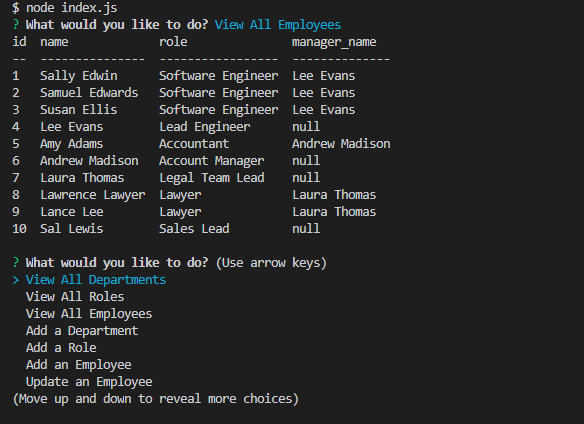
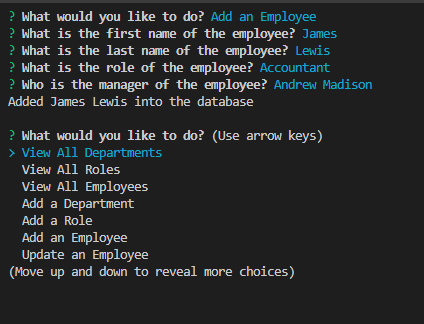

# Employee Tracker

## Table of Contents
- [Description](#description)
- [Installation](#installation)
- [Usage](#usage)
- [Visuals](#visuals)

## Description

The Employee Tracker is a command-line application simulating a content management system(CMS). It uses Node.js, [Inquirer](https://www.npmjs.com/package/inquirer#documentation), and [MySQL2](https://www.npmjs.com/package/mysql2) to add, view, and updates departments, roles, and employees. 

## Installation

Once you download the project, run ```npm install``` in the bash terminal to install dependencies. To create the database, run ```source db/schema.sql``` in the MySQL shell, and to populate the database with default data, run ```source db/seeds.sql``` in the MySQL shell.

## Usage

[Walkthrough video](https://drive.google.com/file/d/1xsryMjgZqcl91jPV77hqmWMui-glNko4/view?usp=sharing)

To start the project, type ```node index.js``` in the bash terminal. Scroll through the options by using the up and down arrow keys, and select what you would like to do by pressing enter. Selecting "View All Departments," "View All Roles," or "View All Employees" will display the selected table in the console. Selecting "Add a Department," "Add a Role," or "Add an Employee" will prompt more questions that will be added to their repective tables. Selecting "Update an Employee" will prompt more questions that will update the role of a specific employee. The application process can be exited by selecting "Quit" or by pressing Ctrl + C (Windows command).

## Visuals


